# WatchNext iOS App

<h1>
WatchNext
</h1>

# WatchNext Backend

[Backend Repository](https://github.com/fauzandwip/BE-WatchNext)

# About App

WatchNext is your ultimate iOS companion for managing your movie wishlist. Tired of forgetting which films you want to watch next? Drowning in a sea of streaming options? WatchNext brings order to your movie mayhem, offering:

- **_Wishlist Creation_**: Add all the must-see movies to your personalized wishlist.
- **_Completion Tracking_**: Mark movies as "watched" to keep track of your cinematic journey and avoid doubles.
- **_Seamless Management_**: Effortlessly add, remove, or update movie details in your wishlist for a dynamic and organized experience.
- **_Deep Dive Details_**: Dive into each film's overview, ratings, and captivating posters for informed decision-making.
- **_Lightning-Fast Search_**: Find that specific movie you've been eyeing in a flash with the intuitive search function.

# Features

This following features of the app was made using Swift, SwiftUI with MVVM :

- Show All Wishlist Movies
- Add New Wishlist Movie
- Update Movie
- Update status is Movie watched
- Delete Movie
- Show Detail Movie
- Search Movie by Title

# Screenshots

## iPhone

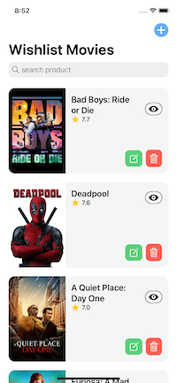
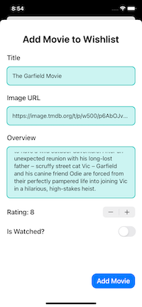

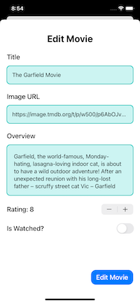
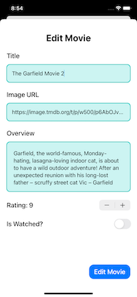
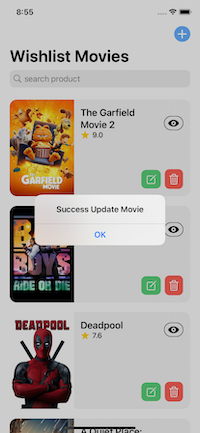
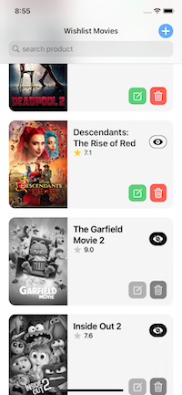
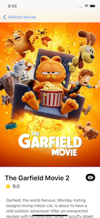
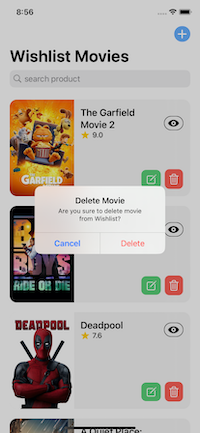
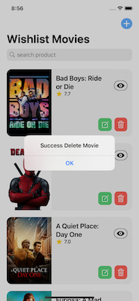
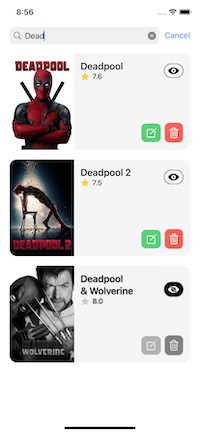

# Demo Video

## iPhone

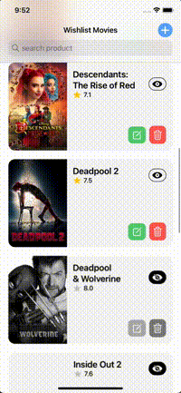

# Tech Stack

## Instalation:

- clone this repo, `https://github.com/fauzandwip/Mobile-WatchNext.git`
- double click file `WatchNext.xcodeproj`
- choose iPhone simulator that you want, you can choose real device too
- run the app by press the run app button or `CMD + R`
